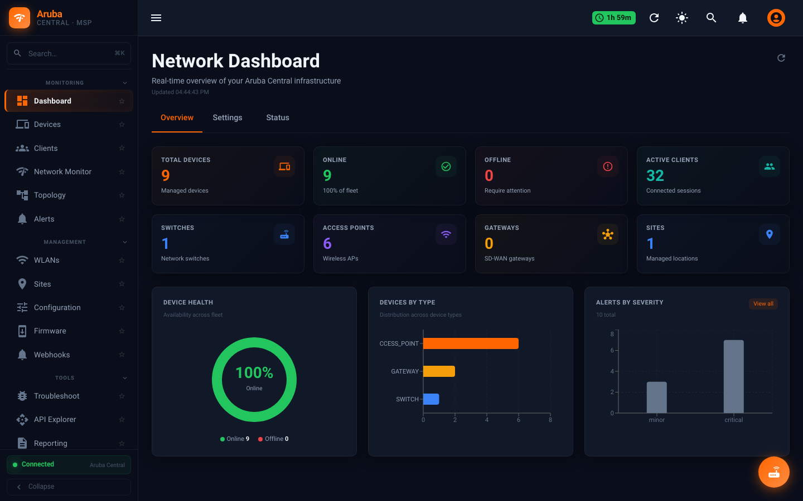
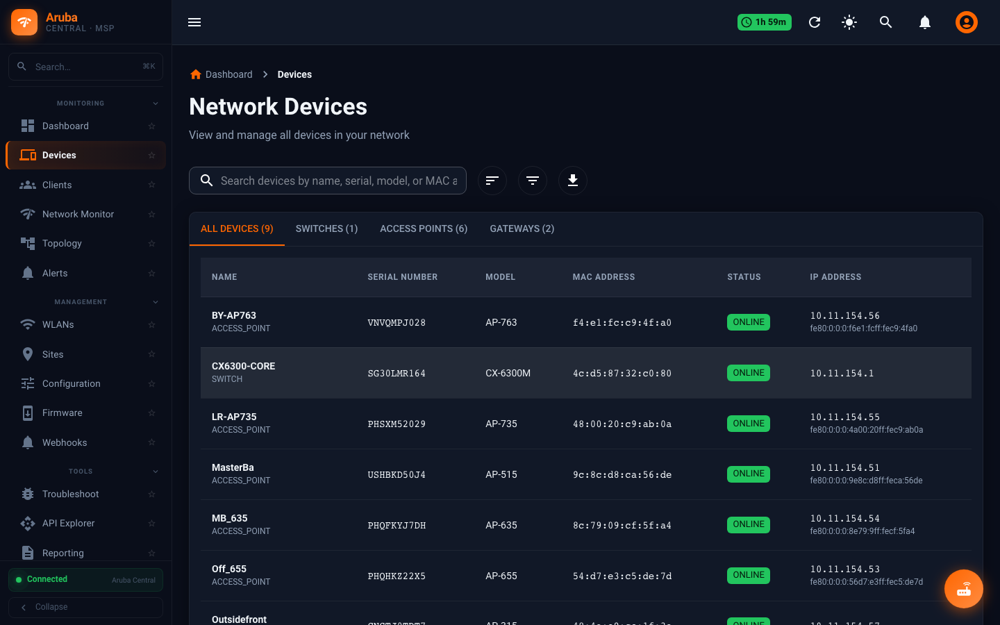
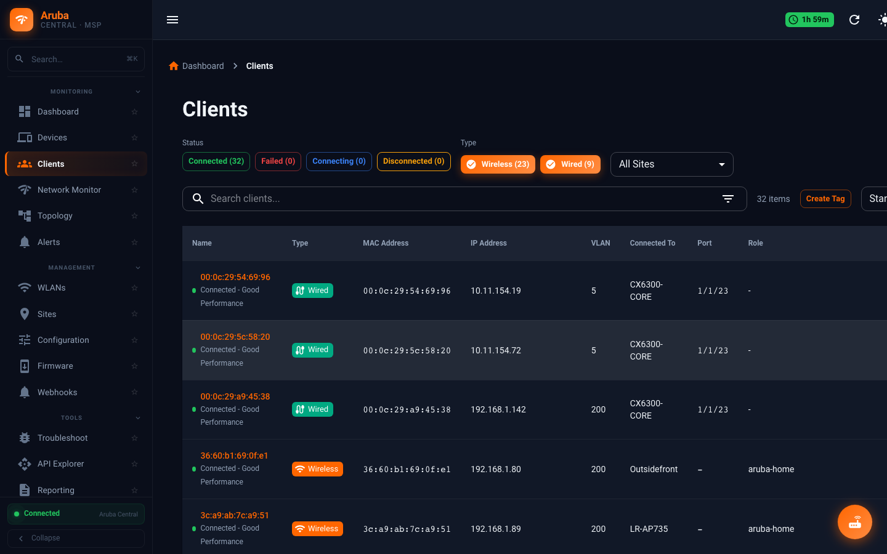
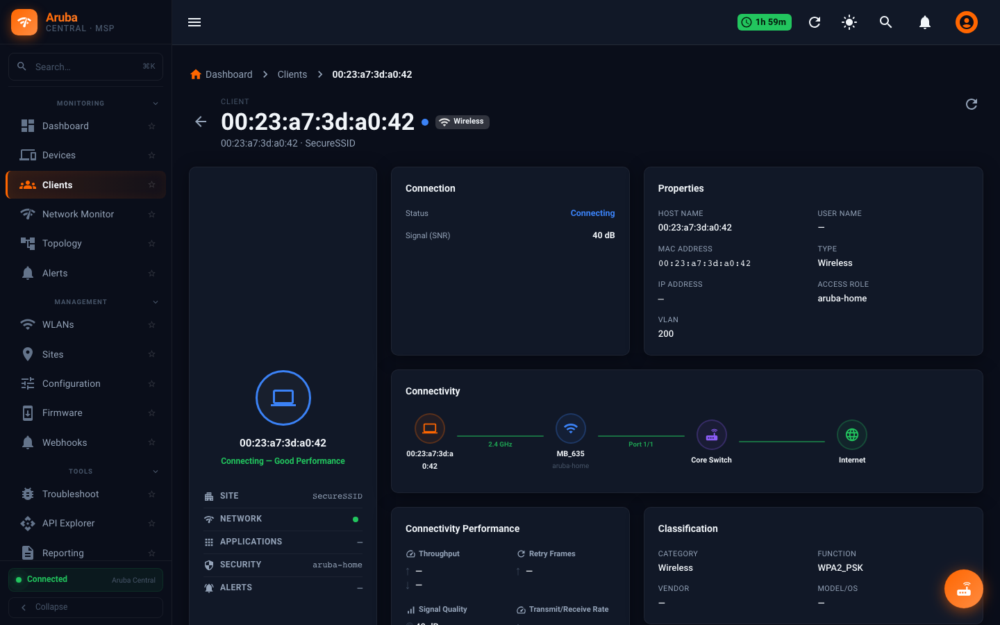
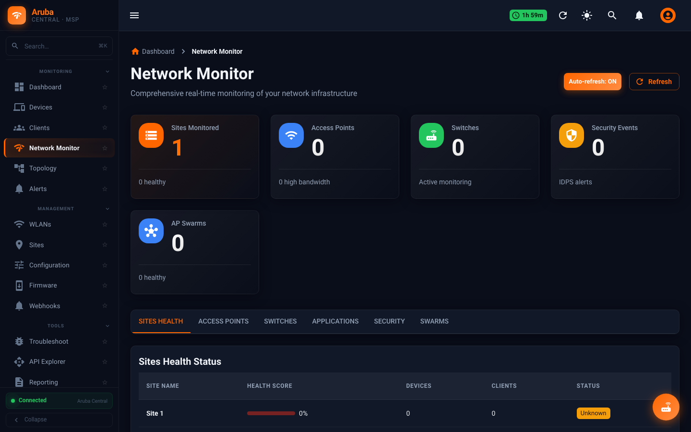
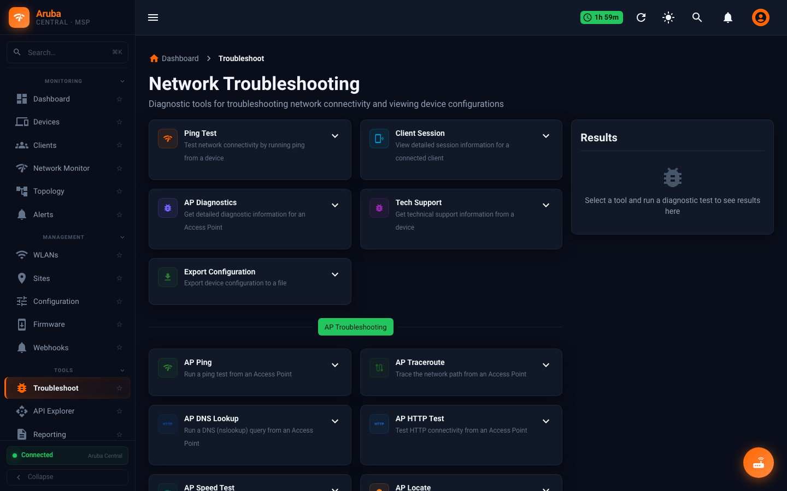
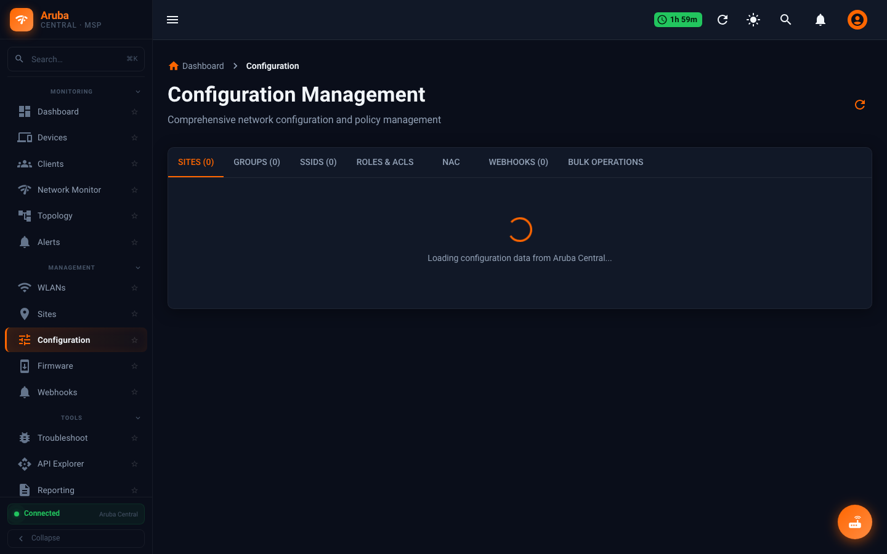
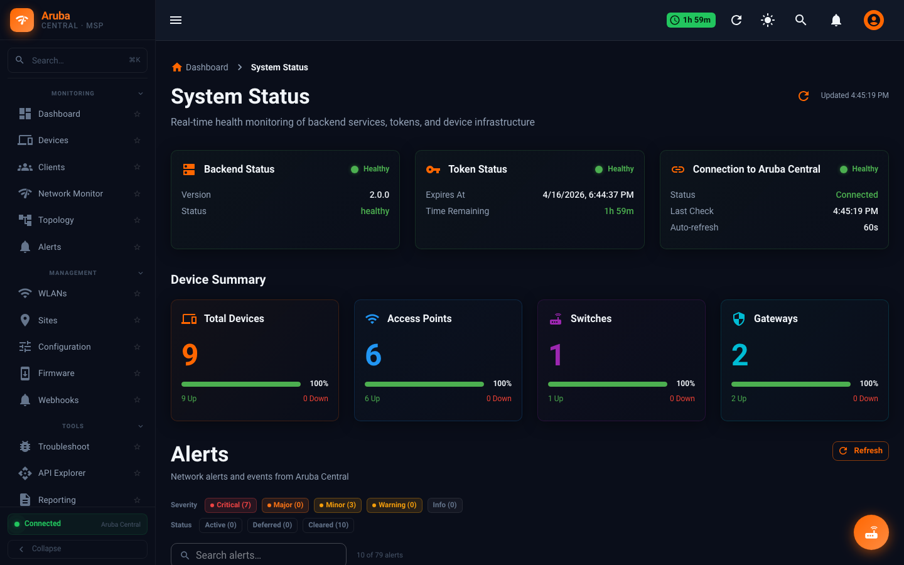
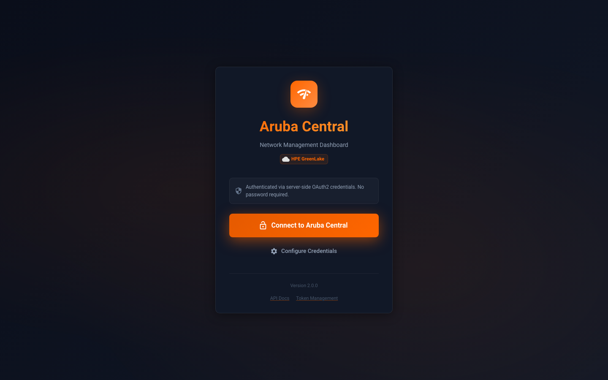

# Aruba Central Portal

[](LICENSE)
[](https://www.python.org/)
[](https://react.dev/)
[](https://flask.palletsprojects.com/)
[](DOCKER.md)

Web dashboard and Python automation toolkit for HPE Aruba Central.

- **Dashboard** — Flask + React SPA for devices, clients, monitoring, WLAN configuration, troubleshooting, and HPE GreenLake RBAC.
- **Scripts** — reusable Python utilities for discovery, WLAN operations, user management, MSP workflows, and monitoring.
- **Docker-first** — one command to run the portal anywhere Docker runs.

---

## Screenshots

| Dashboard | Devices | Clients |
|-----------|---------|---------|
|  |  |  |

| Client Detail | Network Monitor | Troubleshooting |
|---------------|-----------------|-----------------|
|  |  |  |

| Configuration | Status | GreenLake |
|---------------|--------|-----------|
|  |  |  |

---

## Quick Start

### Docker (recommended)

```bash
git clone https://github.com/secure-ssid/aruba-central-portal.git
cd aruba-central-portal
docker compose up -d
```

Open `http://localhost:1344` and complete the Setup Wizard. Full guide: [DOCKER.md](DOCKER.md).

### Local development

```bash
git clone https://github.com/secure-ssid/aruba-central-portal.git
cd aruba-central-portal
python3 -m venv venv && source venv/bin/activate
make install-dev

# Backend
./venv/bin/python dashboard/backend/app.py &

# Frontend (separate terminal)
cd dashboard/frontend && npm install && npm run dev
```

Open `http://localhost:1344`. Full guide: [docs/SETUP.md](docs/SETUP.md).

---

## Credentials

You need three values from Aruba Central (**Account Home → API Gateway → System Apps & Tokens**):

- Client ID
- Client Secret
- Customer ID

Plus your region's base URL:

| Region  | Base URL                                              |
|---------|-------------------------------------------------------|
| US East | `https://apigw-prod2.central.arubanetworks.com`       |
| US West | `https://apigw-uswest4.central.arubanetworks.com`     |
| EU      | `https://apigw-eucentral3.central.arubanetworks.com`  |
| APAC    | `https://apigw-apeast1.central.arubanetworks.com`     |

Paste them into the Setup Wizard at `http://localhost:1344` — no manual `.env` editing needed.

---

## Project Layout

```
aruba-central-portal/
├── dashboard/
│   ├── backend/        # Flask app + routes (auth, devices, monitoring,
│   │                   #   config, troubleshoot, greenlake, chat)
│   └── frontend/       # React (Vite) SPA
├── scripts/            # Automation CLIs (discovery, network/wlan,
│                       #   users, tenants, monitoring, wlan-testing,
│                       #   ops, testing)
├── utils/              # Shared Python: API client, token manager, config
├── tests/              # Pytest suite (>90% coverage on utils/)
├── docs/               # Project, API, and solution-guide docs
├── tools/              # Diagnostics (e.g. GreenLake troubleshooter)
├── Dockerfile
└── docker-compose.yml
```

---

## Documentation

| Doc | What it covers |
|-----|----------------|
| [DOCKER.md](DOCKER.md) | Docker setup, operations, updating, troubleshooting |
| [docs/SETUP.md](docs/SETUP.md) | Local dev setup (Python + Node) |
| [docs/DEV_SETUP.md](docs/DEV_SETUP.md) | Windows / PowerShell dev setup |
| [docs/ENV_VARIABLES.md](docs/ENV_VARIABLES.md) | Every environment variable |
| [docs/CONFIGURATION.md](docs/CONFIGURATION.md) | `config.yaml`, token cache, auth flows |
| [docs/HOW_IT_WORKS.md](docs/HOW_IT_WORKS.md) | Architecture, request flow, security model |
| [docs/SETUP_WIZARD_GUIDE.md](docs/SETUP_WIZARD_GUIDE.md) | Walk-through of the in-app Setup Wizard |
| [docs/GREENLAKE_ROLES.md](docs/GREENLAKE_ROLES.md) | Two-tier RBAC (platform + service) |
| [docs/USER_MANAGEMENT_GUIDE.md](docs/USER_MANAGEMENT_GUIDE.md) | Managing users via scripts |
| [docs/dashboard/ARCHITECTURE.md](docs/dashboard/ARCHITECTURE.md) | Dashboard deep-dive |
| [docs/dashboard/FEATURES.md](docs/dashboard/FEATURES.md) | Feature inventory |
| [docs/troubleshooting/](docs/troubleshooting/) | Known issues and fixes |
| [CLAUDE.md](CLAUDE.md) | Conventions and commands for contributors |

---

## Common Tasks

```bash
make help          # Show all make targets
make test          # Run pytest
make test-cov      # Coverage report
make lint          # ruff
make format        # black
make type-check    # mypy
make all           # format + lint + type-check + test
```

Update a running Docker deployment:

```bash
git pull && docker compose up -d --build
```

View logs:

```bash
docker compose logs -f aruba-central-portal
```

---

## Troubleshooting

- **Dashboard won't start:** `docker compose logs aruba-central-portal`
- **"Token refresh failed 400":** Normal pre-setup; finish the Setup Wizard.
- **Port 1344 in use:** see [docs/troubleshooting/FIX_PORT_1344.md](docs/troubleshooting/FIX_PORT_1344.md).
- **Node.js not found (Windows):** see [docs/troubleshooting/FIX_NODEJS_PATH.md](docs/troubleshooting/FIX_NODEJS_PATH.md).
- **GreenLake RBAC endpoints failing:** run `./tools/diagnose-greenlake.sh`.

---

## Security

- Never commit `.env` or `config.local.yaml`. Both are in `.gitignore`.
- Credentials live in environment variables only.
- Use least-privilege OAuth2 scopes; rotate client secrets periodically.
- Terminate TLS at a reverse proxy in production ([DOCKER.md](DOCKER.md#https-in-production)).

See [docs/GIT_SECURITY.md](docs/GIT_SECURITY.md) for repo hygiene rules.

---

## License

MIT — see [LICENSE](LICENSE).
